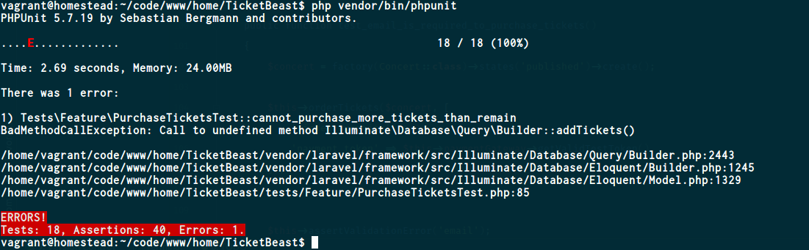

# Ticket Beast

## Section 1

1. Deciding what features to use
2. Building first Feature test, end to end test.
3. Running first test
    - setting up sqlite in memory DB
4. Unit testing the Concert model
5. Refactoring Code while keeping tests passing
6. Add more features to the Feature Test
7. Refactoring Controller using Concert Unit testing
8. Applying Model factory states to create more readable tests

> Remember to refactor test names as code develops to be more descriptive of the test as the test set builds up

## Section 2

1. Pros on cons of end to end browser and ened to end point Testig
2. Setting up payment Test
3. 
4. Using a fake to mock a third party appliction
5. Create ConcertOrders Controller and test driving first order create. Migrations for Orders and Tickets tables +
relationships created
6. Add test for json request validation and refactoring of the ConcertOrdersController
7. Add more test for request validation. Interesting ideas for testing different validation rule replies using the
assertArrayKey and the Json Decode method. See PurchaseTicketsTest
8. Refactoring the PurchaseTicketsTest to be more expressive, using helper functions to wrap commonly used items
such as the post request made. The assertions wee also encapsulated. This is a great technique for creating more
readable test.
9. Shows way of using try catch to assert tests past rather than using @exception notation in doc blocks of the
test. This method allows for further assertions to be made on the exception however this is not shown in this video,
only discussed. A custom Exception handler is created and try catch blocks added to the controller to throw new
exception. This is then tested for.
10. The test were updated to hand published and unpublished concerts with a test to see that unpublished concerts
couldn't have tickets bought for them. The controller method for storing the ticket methods has been updated to
 prioritise exceptions as several exceptions can be thrown in that controller.

## Section 3

1. Outlining the first test case.
	- At the end of this, the test suite should fail with the following:
	
2. Adding Tickets to Concerts.
	- Instead of fixing the feature test that was failing at the end of the previous episode, it is a good idea to instead drop down to the unit level - to drive out this "adding tickets" behaviour.
	- The following test `can_add_tickets` was then added at unit level. At this point, the `addTickets()` method used in this test does not exist on the Concert model - so to satisfy this part of the test, an empty method with the same name was subsequently added to the Concert model with just a parameter to handle the quantity. Now, the test still fails due to another error, as the `ticketsRemaining()` method does not exist. Again, an empty method stub for `ticketsRemaining` was added to the concert model. At this point, this is where the actual logic is added for this feature, which includes adding a `tickets` relationship, being able to actually add tickets, and being able to actually retrieve the remaining tickets. The method `orderTickets` which already existed, was updated as part of the refactoring stage to make the tests pass.
	- A key part of this episode was incrementally adding changes by trying to do the bare minimum to stafisy the next failure until all the tests pass. Another key part was following the idea of "programming by wishful thinking".
	